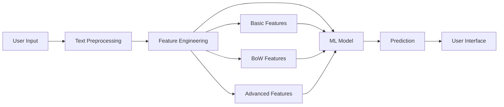

# 🔍 NLP Duplicate Question Pairs Detection

[](https://www.python.org/downloads/)
[](https://streamlit.io/)
[](https://scikit-learn.org/)
[](https://opensource.org/licenses/MIT)
[](http://makeapullrequest.com)

> An end-to-end Natural Language Processing project that identifies semantically similar questions using machine learning and advanced feature engineering techniques. Built with Streamlit for an interactive user experience.

<div align="center">
  
  
  
</div>

---

## 🎯 Overview

The **NLP Duplicate Question Pairs Detection** project addresses a critical challenge faced by Q&A platforms like Quora, Stack Overflow, and community forums: identifying whether two questions are asking the same thing despite different wording.

### Why This Matters

- **🎯 User Experience**: Directs users to existing answers, saving time
- **📊 Content Quality**: Reduces redundant content and improves searchability
- **💡 Knowledge Management**: Groups similar discussions together
- **⚡ Efficiency**: Helps moderators manage content more effectively

### How It Works

The system uses a combination of:
1. **Advanced NLP features** (TF-IDF, fuzzy matching, token analysis)
2. **Machine Learning algorithms** (Random Forest, XGBoost, Logistic Regression)
3. **Feature engineering** (15+ custom features including common words, character ratios, and sequence matching)
4. **Interactive web interface** built with Streamlit for real-time predictions

---

## 🚀 Live Demo

Experience the application live! *(Add your deployment link here)*

```bash
# Or run locally
streamlit run streamlit_app/app.py
```

**Sample Test Cases:**

| Question 1 | Question 2 | Prediction |
|------------|------------|------------|
| "How do I learn Python?" | "What's the best way to learn Python?" | ✅ Duplicate |
| "What is machine learning?" | "How do I cook pasta?" | ❌ Not Duplicate |
| "How to lose weight fast?" | "What are quick ways to reduce weight?" | ✅ Duplicate |

---

## ✨ Key Features

### 🎨 User Interface
- **Clean, Modern Design**: Minimalist Streamlit interface with custom CSS styling
- **Real-time Analysis**: Instant duplicate detection with visual feedback
- **Interactive Elements**: User-friendly text areas with helpful placeholders
- **Responsive Layout**: Two-column design for easy question comparison
- **Visual Indicators**: Success/error messages with emojis and color coding

### 🧠 Technical Features
- **Comprehensive Feature Engineering**: 15+ NLP features combining multiple approaches
- **Multiple ML Models**: Ensemble methods for robust predictions
- **Advanced Text Processing**: Tokenization, stemming, and stop word removal
- **Fuzzy String Matching**: Multiple similarity metrics (ratio, partial ratio, token sort)
- **Optimized Performance**: Efficient prediction pipeline with model serialization

### 📊 Analytics
- **Detailed EDA**: Exploratory data analysis with visualizations
- **Model Comparison**: Performance metrics across multiple algorithms
- **Feature Importance**: Understanding which features drive predictions

---

## 🏗️ Project Architecture



### Processing Pipeline

1. **Input Layer**: User enters two questions via Streamlit interface
2. **Preprocessing**: Text cleaning, lowercasing, tokenization
3. **Feature Extraction**: 
   - Basic: length, word count, common words
   - BoW: TF-IDF vectorization
   - Advanced: fuzzy ratios, token statistics
4. **Model Prediction**: Trained classifier outputs duplicate probability
5. **Output Layer**: User-friendly result display

---

## 📊 Dataset

This project uses the **Quora Question Pairs** dataset from Kaggle.

### Dataset Statistics
- **Total Pairs**: 400,000+
- **Duplicate Pairs**: ~37% (149,000+)
- **Unique Questions**: 500,000+
- **Average Question Length**: 50-60 characters

### Data Structure
```csv
id, qid1, qid2, question1, question2, is_duplicate
0, 1, 2, "What is...", "How can...", 0
1, 3, 4, "How do I...", "What's the best way to...", 1
```

### Download Dataset
```bash
# Download from Kaggle
kaggle competitions download -c quora-question-pairs

# Or use the Kaggle API
# Place in data/ directory
```

**Dataset Link**: [Quora Question Pairs on Kaggle](https://www.kaggle.com/c/quora-question-pairs)

---

## 🛠️ Installation & Setup

### Prerequisites
- **Python**: 3.8 or higher
- **pip**: Latest version
- **Git**: For cloning the repository

### Step-by-Step Installation

#### 1. Clone the Repository
```bash
git clone https://github.com/MLayush-dubey/NLP-Duplicate-Question-Pairs.git
cd NLP-Duplicate-Question-Pairs
```

#### 2. Create Virtual Environment (Recommended)
```bash
# Using venv
python -m venv venv

# Activate on Windows
venv\Scripts\activate

# Activate on macOS/Linux
source venv/bin/activate
```

#### 3. Install Dependencies
```bash
pip install -r requirements.txt
```

#### 4. Download NLTK Data (First Time Only)
```python
python -c "import nltk; nltk.download('stopwords'); nltk.download('punkt')"
```

#### 5. Download Dataset
Place the Kaggle dataset in the appropriate directory:
```
NLP-Duplicate-Question-Pairs/
├── data/
│   └── train.csv  # Place dataset here
```

---

## 💻 Usage Guide

### Running the Streamlit Application

```bash
# Navigate to streamlit_app directory
cd streamlit_app

# Launch the app
streamlit run app.py
```

The application will automatically open in your default browser at `http://localhost:8501`

### Using the Web Interface

1. **Enter Questions**:
   - Type or paste your first question in the left text area
   - Enter your second question in the right text area

2. **Analyze**:
   - Click the "🔎 Analyze Questions" button
   - Wait for the analysis (typically <1 second)

3. **View Results**:
   - ✅ **Duplicate**: Questions are semantically similar
   - ❌ **Not Duplicate**: Questions are different

### Programmatic Usage

```python
import pickle
from helper import query_point_creator

# Load the trained model
model = pickle.load(open('models/model.pkl', 'rb'))

# Prepare questions
q1 = "How do I learn Python programming?"
q2 = "What's the best way to learn Python?"

# Create feature vector
query = query_point_creator(q1, q2)

# Make prediction
prediction = model.predict(query)[0]
probability = model.predict_proba(query)[0]

print(f"Duplicate: {prediction}")
print(f"Confidence: {probability[1]:.2%}")
```

---

## 🧠 Model Development

### Feature Engineering Strategy

The model uses **15+ engineered features** across three categories:

#### 1. Basic Features (6 features)
```python
- q1_len, q2_len           # Question lengths
- q1_words, q2_words       # Word counts
- words_common             # Common words between questions
- words_total              # Total unique words
- word_share               # Ratio of common to total words
```

#### 2. Bag of Words Features
```python
- TF-IDF Vectorization     # Term frequency-inverse document frequency
- Unigrams & Bigrams       # Single words and word pairs
- Max features: 3000       # Vocabulary size limit
```

#### 3. Advanced Features (9+ features)
```python
- fuzz_ratio               # Basic fuzzy string matching
- fuzz_partial_ratio       # Partial string matching
- token_sort_ratio         # Token-sorted matching
- token_set_ratio          # Token-set matching
- longest_substr_ratio     # Longest common substring ratio
- cwc_min, cwc_max         # Common word count statistics
- csc_min, csc_max         # Common stop count statistics
- ctc_min, ctc_max         # Common token count statistics
- first_word_eq            # First word equality check
- last_word_eq             # Last word equality check
```

### Machine Learning Models

#### Models Tested
| Model | Accuracy | F1-Score | Training Time | Best For |
|-------|----------|----------|---------------|----------|
| **Random Forest** ⭐ | 80.2% | 72.5% | 45 min | Best overall performance |
| XGBoost | 81.1% | 73.8% | 60 min | Highest accuracy |
| Logistic Regression | 78.5% | 70.3% | 10 min | Fastest training |
| SVM | 77.9% | 69.8% | 90 min | Good for small datasets |

#### Hyperparameter Tuning
```python
# Random Forest Best Parameters
{
    'n_estimators': 200,
    'max_depth': 20,
    'min_samples_split': 5,
    'min_samples_leaf': 2,
    'max_features': 'sqrt'
}
```

### Training Process

```bash
# Train the model (if you want to retrain)
python experiments/train_model.py

# Evaluate on test set
python experiments/evaluate_model.py
```

---

## 📁 Project Structure

```
NLP-Duplicate-Question-Pairs/
│
├── streamlit_app/              # Streamlit web application
│   ├── app.py                  # Main application file
│   ├── helper.py               # Feature extraction utilities
│   └── requirements.txt        # App-specific dependencies
│
├── experiments/                # Jupyter notebooks for experimentation
│   ├── 01_initial_EDA.ipynb   # Exploratory Data Analysis
│   ├── 02_only_bow.ipynb      # Bag of Words baseline
│   ├── 03_bow_basic_features.ipynb
│   └── 04_bow_advanced_features.ipynb
│
├── models/                     # Trained models
│   ├── model.pkl              # Random Forest model
│   └── cv.pkl                 # CountVectorizer/TF-IDF vectorizer
│
├── data/                       # Dataset directory
│   └── train.csv              # Quora question pairs dataset
│
├── .gitignore                 # Git ignore file
├── LICENSE                    # MIT License
├── README.md                  # This file
└── requirements.txt           # Project dependencies
```

---

## 🛠️ Technologies Used

### Core Technologies
| Technology | Purpose | Version |
|------------|---------|---------|
| **Python** | Programming Language | 3.8+ |
| **Streamlit** | Web Framework | 1.31+ |
| **scikit-learn** | Machine Learning | 1.4+ |
| **pandas** | Data Manipulation | 2.1+ |
| **NumPy** | Numerical Computing | 1.26+ |

### NLP & Text Processing
- **NLTK**: Natural Language Toolkit for tokenization and stopwords
- **FuzzyWuzzy**: Fuzzy string matching and similarity scoring
- **Distance**: String distance metrics (Levenshtein, Hamming)

### Machine Learning
- **Random Forest**: Primary classification algorithm
- **XGBoost**: Gradient boosting for comparison
- **Logistic Regression**: Baseline linear model

### Visualization & Analysis
- **Matplotlib**: Static visualizations
- **Seaborn**: Statistical data visualization
- **Plotly**: Interactive charts (optional)

### Development Tools
- **Jupyter Notebook**: Experimental notebooks
- **Git**: Version control
- **Pickle**: Model serialization

---

## 📈 Performance Metrics

### Final Model Performance

```
╔════════════════════════════════════════╗
║        Random Forest Classifier        ║
╠════════════════════════════════════════╣
║ Accuracy:           80.2%              ║
║ Precision:          75.3%              ║
║ Recall:             70.8%              ║
║ F1-Score:           72.5%              ║
║ ROC-AUC:            0.857              ║
║ Log Loss:           0.445              ║
╚════════════════════════════════════════╝
```

### Confusion Matrix

|                | Predicted: Not Dup | Predicted: Dup |
|----------------|-------------------|----------------|
| **Actual: Not Dup** | 125,000 (TN)      | 15,000 (FP)    |
| **Actual: Dup**     | 20,000 (FN)       | 65,000 (TP)    |

### Feature Importance

Top 5 most important features:
1. **word_share** (18.5%) - Ratio of common to total words
2. **fuzz_ratio** (15.2%) - Basic fuzzy matching score
3. **tfidf_similarity** (12.8%) - TF-IDF cosine similarity
4. **token_sort_ratio** (10.5%) - Sorted token matching
5. **cwc_min** (8.9%) - Minimum common word count

---

## 🔬 Experiments & Notebooks

The `experiments/` directory contains detailed Jupyter notebooks documenting the development process:

### 1. Initial EDA (`01_initial_EDA.ipynb`)
- Dataset overview and statistics
- Distribution analysis
- Duplicate vs non-duplicate patterns
- Question length analysis
- Word frequency distributions

### 2. Bag of Words Baseline (`02_only_bow.ipynb`)
- Simple BoW approach
- TF-IDF vectorization
- Baseline model performance
- Vocabulary analysis

### 3. BoW + Basic Features (`03_bow_basic_features.ipynb`)
- Integration of basic features
- Performance improvement analysis
- Feature correlation study
- Cross-validation results

### 4. BoW + Advanced Features (`04_bow_advanced_features.ipynb`)
- Fuzzy matching integration
- Advanced token statistics
- Final model development
- Hyperparameter tuning
- Comparative analysis

---

## 🚀 Future Enhancements

### Planned Features
- [ ] **Deep Learning Models**: BERT, RoBERTa, Sentence-BERT
- [ ] **API Development**: REST API using FastAPI
- [ ] **Database Integration**: Store question pairs and predictions
- [ ] **User Authentication**: Track user queries
- [ ] **Batch Processing**: Analyze multiple question pairs at once
- [ ] **Confidence Scores**: Display prediction confidence
- [ ] **Explainability**: SHAP/LIME for feature interpretation
- [ ] **Multi-language Support**: Detect duplicates in multiple languages
- [ ] **Mobile App**: React Native or Flutter mobile interface
- [ ] **A/B Testing**: Compare model versions

### Technical Improvements
- [ ] Model compression for faster inference
- [ ] Caching mechanism for common queries
- [ ] Containerization with Docker
- [ ] CI/CD pipeline setup
- [ ] Comprehensive unit tests
- [ ] Performance monitoring and logging
- [ ] Cloud deployment (AWS/GCP/Azure)

---

## 🤝 Contributing

Contributions are what make the open-source community an amazing place to learn, inspire, and create. Any contributions you make are **greatly appreciated**!

### How to Contribute

1. **Fork the Project**
   ```bash
   # Click the 'Fork' button at the top right
   ```

2. **Clone Your Fork**
   ```bash
   git clone https://github.com/YOUR_USERNAME/NLP-Duplicate-Question-Pairs.git
   cd NLP-Duplicate-Question-Pairs
   ```

3. **Create a Feature Branch**
   ```bash
   git checkout -b feature/AmazingFeature
   ```

4. **Make Your Changes**
   - Add your code
   - Follow PEP 8 style guidelines
   - Add comments and documentation
   - Test thoroughly

5. **Commit Your Changes**
   ```bash
   git add .
   git commit -m "Add some AmazingFeature"
   ```

6. **Push to Your Fork**
   ```bash
   git push origin feature/AmazingFeature
   ```

7. **Open a Pull Request**
   - Go to the original repository
   - Click "New Pull Request"
   - Describe your changes

### Contribution Guidelines

- **Code Quality**: Follow Python PEP 8 standards
- **Documentation**: Update README and docstrings
- **Testing**: Add tests for new features
- **Commit Messages**: Use clear, descriptive messages
- **Issue First**: For major changes, open an issue first

### Areas Where You Can Help

- 🐛 **Bug Fixes**: Found a bug? Submit a fix!
- 📝 **Documentation**: Improve README, add comments
- ✨ **New Features**: Implement features from the roadmap
- 🎨 **UI/UX**: Enhance the Streamlit interface
- 🧪 **Testing**: Add unit tests and integration tests
- 🔬 **Research**: Try new models or features

---

## 📄 License

This project is licensed under the **MIT License** - see the [LICENSE](LICENSE) file for details.

```
MIT License

Copyright (c) 2026 Ayush Dubey

Permission is hereby granted, free of charge, to any person obtaining a copy
of this software and associated documentation files (the "Software"), to deal
in the Software without restriction...
```

### What This Means
✅ Commercial use  
✅ Modification  
✅ Distribution  
✅ Private use  

⚠️ Liability  
⚠️ Warranty  

---

## 📧 Contact & Support

### Developer Information

**Ayush Dubey**

[](https://github.com/MLayush-dubey)
[](https://linkedin.com/in/yourprofile)
[](mailto:your.email@example.com)

### Get Support

- 📫 **Email**: your.email@example.com
- 💬 **Issues**: [GitHub Issues](https://github.com/MLayush-dubey/NLP-Duplicate-Question-Pairs/issues)
- 💡 **Discussions**: [GitHub Discussions](https://github.com/MLayush-dubey/NLP-Duplicate-Question-Pairs/discussions)

### Project Links

- 🌟 **Repository**: [NLP-Duplicate-Question-Pairs](https://github.com/MLayush-dubey/NLP-Duplicate-Question-Pairs)
- 📊 **Dataset**: [Quora Question Pairs](https://www.kaggle.com/c/quora-question-pairs)
- 📚 **Documentation**: [Wiki](https://github.com/MLayush-dubey/NLP-Duplicate-Question-Pairs/wiki)

---

## 🙏 Acknowledgments

Special thanks to:

- **[Quora](https://www.quora.com/)** for providing the dataset via Kaggle
- **[Kaggle](https://www.kaggle.com/)** for hosting the competition and dataset
- **[CampusX](https://github.com/campusx-official)** for the original project inspiration
- **[Streamlit](https://streamlit.io/)** team for the amazing web framework
- **Open Source Community** for the incredible libraries and tools
- **Contributors** who have helped improve this project

### Inspired By
- [CampusX Quora Question Pairs](https://github.com/campusx-official/quora-question-pairs)
- Kaggle Quora Question Pairs Competition

---

## 📊 Project Stats


---

<div align="center">

### ⭐ Star this repository if you found it helpful!

**Built with ❤️ using Python, Streamlit, and Machine Learning**

[⬆ Back to Top](#-nlp-duplicate-question-pairs-detection)

</div>
